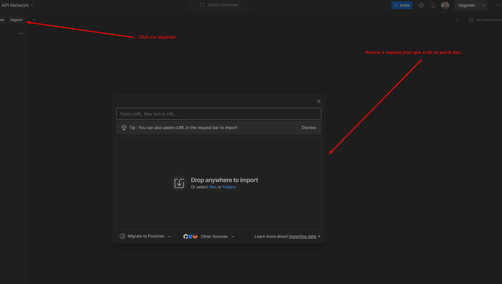
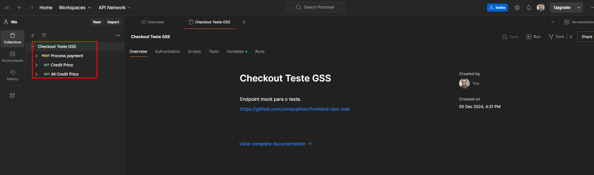

# Desafio: Checkout para Compensação de Carbono

Neste desafio, você deverá recriar um layout de checkout fictício para compensação de carbono, conforme o design fornecido no Figma. Além disso, será necessário consumir dois endpoints da API:

1. **Obter o valor do crédito**: Esse endpoint será responsável por retornar o valor do crédito de carbono, que deve ser exibido durante o checkout.
2. **Simulação de processamento de pagamento**: O segundo endpoint será utilizado para simular o processamento de um pagamento após o usuário completar o checkout.

Ambos os endpoints devem ser integrados na aplicação de forma que a experiência do usuário no checkout seja fluida e os valores exibidos no sistema estejam corretos.

## Requisitos

- **URL do Checkout:** A aplicação deve utilizar um URL no seguinte formato:
````https://meu-teste.com/checkout?co2=1&cred=2````

Onde:
- **`co2`**: Representa a quantidade de carbono.
- **`cred`**: Representa o valor do crédito (ou `creditPriceId`).

O valor do crédito de carbono, que será atribuído ao parâmetro `cred` (ou `creditPriceId`), deve ser recuperado através do endpoint **`get credit price`**. Esse endpoint está documentado na pasta **`doc`** e retorna o valor do crédito de carbono associado ao `creditPriceId`. A aplicação deve realizar a requisição para esse endpoint para obter o valor correspondente e preenchê-lo dinamicamente o valor no checkout.

A requisição ao endpoint `Get Credit Price` é necessária para garantir que o valor do crédito esteja sempre atualizado e de acordo com as especificações do sistema.

FIGMA:
[LAYOUT](https://www.figma.com/design/3dbuGSs6oCSLkPw9viSsfT/Front-end-Teste?node-id=0-1&t=KvUCyOT5Miiuh0D5-1)

## Consumo da API Mock

Use a API mock do Postman diponibilizada em /docs.

### Importação da Coleção do Postman

Siga as etapas abaixo para importar a coleção e testar os endpoints do checkout.

1. Abra o Postman.
2. Clique no botão **Importar** no canto superior esquerdo.

3. Selecione o arquivo `Carbon_Checkout.postman_collection.json` localizado na pasta `doc/`.


4. Execute os testes com os parâmetros fornecidos para verificar o funcionamento correto da aplicação.

-----------------------------------------------------

## FRAMEWORK

- [NEXT.JS](https://nextjs.org/docs)

-----------------------------------------------------

## ESTILOS

- Os estilos deste teste devem ser feitos em styled-components (ou tailwind).
- O projeto ser o mais proximo possivel do layout fornecido.
- Deve ser totalmente responsivo.

## REQUISITOS DIFERENCIAIS:

- Back-end (para desenvolvedores full-stack)
- Código performático.
- Manutenibilidade do Código.
- Utilizar inglês no projeto todo.
- Fazer deploy do mesmo (heroku, netlify, aws, vercel, github pages ou outro da preferência).

## GIT
- Faça um fork deste repositório.
- Criar uma branch para codar as suas features.
- Criar um pull-request quando o teste for finalizado e submetido.

## Contato técnico.
- Junior Schmidt
- GSS | Desenvolvedor Back-end & Tech Lead.
- schmidt@repenso.eco
- www.gss.eco
