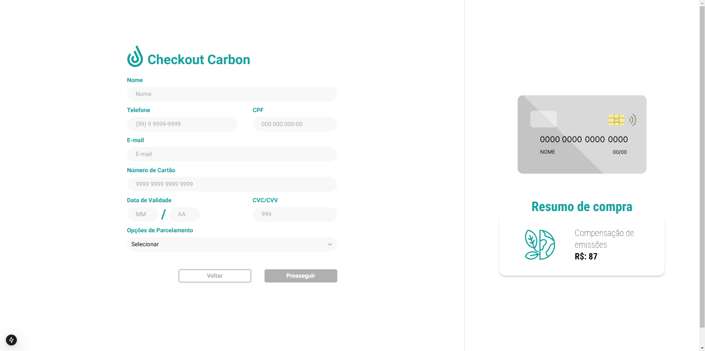
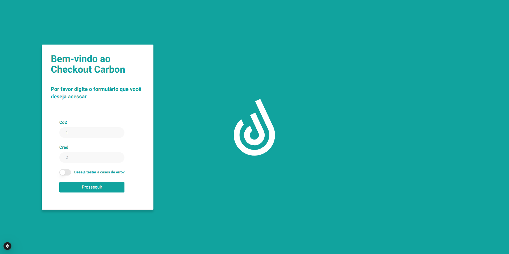
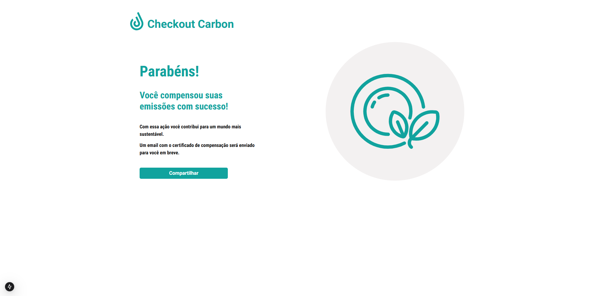
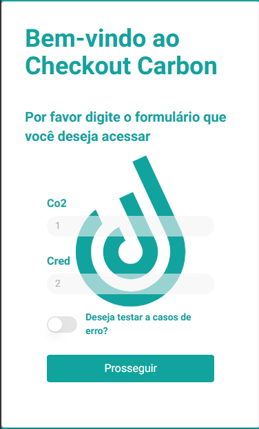
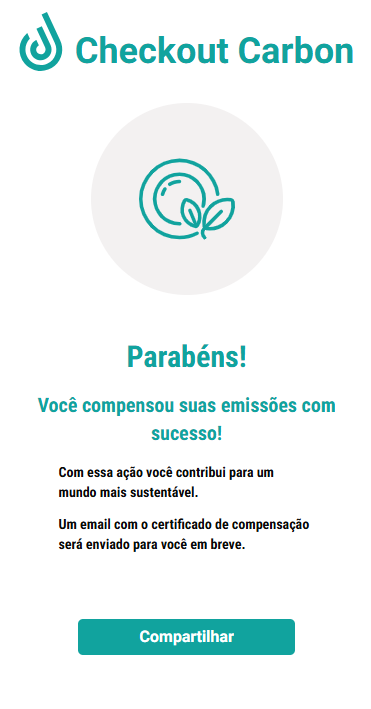

<div align="center">
  <h1 align="center">
    Checkout Carbon
    <br />
    <br />
      
  </h1>
</div>
<p align="center">
  
<p/>

# Tabela de Conteúdos
  
* [Tabela de Conteúdos](#tabela-de-conteúdos)
* [Introdução](#introdução)
* [Desafio](#desafio)
    * [Requisitos](#requisitos)
* [Como rodar a aplicação](#como-rodar-a-aplicação)
* [Acessar aplicação hospedada](#acessar-aplicação-hospedada)
* [API Mock](#api-mock)
* [Screenshots](#screenshots)
* [Tecnologias Utilizadas](#tecnologias-utilizadas)
* [Contato técnico](#contato-técnico)

# Introdução

Essa é uma aplicação que simula a compensação de carbono.<br>
Foi desenvolvida para um seguindo as instruções do desafio abaixo.


# Desafio

Neste desafio, você deverá recriar um layout de checkout fictício para compensação de carbono, conforme o design fornecido no Figma. Além disso, será necessário consumir dois endpoints da API:

1. **Obter o valor do crédito**: Esse endpoint será responsável por retornar o valor do crédito de carbono, que deve ser exibido durante o checkout.
2. **Simulação de processamento de pagamento**: O segundo endpoint será utilizado para simular o processamento de um pagamento após o usuário completar o checkout.

Ambos os endpoints devem ser integrados na aplicação de forma que a experiência do usuário no checkout seja fluida e os valores exibidos no sistema estejam corretos.

## Requisitos

- **URL do Checkout:** A aplicação deve utilizar um URL no seguinte formato:
````https://meu-teste.com/checkout?co2=1&cred=2````

Onde:
- **`co2`**: Representa a quantidade de carbono.
- **`cred`**: Representa o valor unitario do crédito (ou creditPriceId).

O valor do crédito de carbono, que será atribuído ao parâmetro `cred` (ou `creditPriceId`), deve ser recuperado através do endpoint **`get credit price`**. Esse endpoint está documentado na pasta **`doc`** e retorna o valor do crédito de carbono associado ao `creditPriceId`. A aplicação deve realizar a requisição para esse endpoint para obter o valor correspondente e preenchê-lo dinamicamente o valor no checkout.

A requisição ao endpoint `Get Credit Price` é necessária para garantir que o valor do crédito esteja sempre atualizado e de acordo com as especificações do sistema.

# Como rodar a aplicação

Após clonar o repositório, rode os seguintes comandos em seu terminal para acessar a aplicação em produção:

```
$ npm install
$ npm run build
$ npm run start

```
**Obs:** Lembre de criar o arquivo .env para o endpoint da api

# Acessar aplicação hospedada

Para acessar a aplicação hospedada na Vercel, click [aqui](https://frontend-test-tree-three.vercel.app/)

# API Mock

A MockAPI utilizada para a aplicação é a que foi disponibilizada pelo teste. Seu url pode ser encontrado na coleção do Postman
# Screenshots
<div>
<p>Full Screen</p>
<p width="100%">



</p>
<p width="100%">


</p>
<p>Mobile</p>
<p width="100%">



</p>
<p width="100%">


</p>
</div>


# Tecnologias Utilizadas
 - [Next.js](https://nextjs.org/)
 - [Tailwindcss](https://tailwindcss.com/)
 - [React-hook-form](https://react-hook-form.com/)
 - [Zod](https://zod.dev/)
 - [@hookform/resolvers](https://www.npmjs.com/package/@hookform/resolvers/v/1.3.7)
 - [imask](https://imask.js.org/)
 - [Shadcn/ui](https://ui.shadcn.com/)
 - [Axios](https://axios-http.com/ptbr/docs/intro)
-----------------------------------------------------
## Contato técnico
- Daniel Colares Schmidt
- danielmcolares@gmail.com
